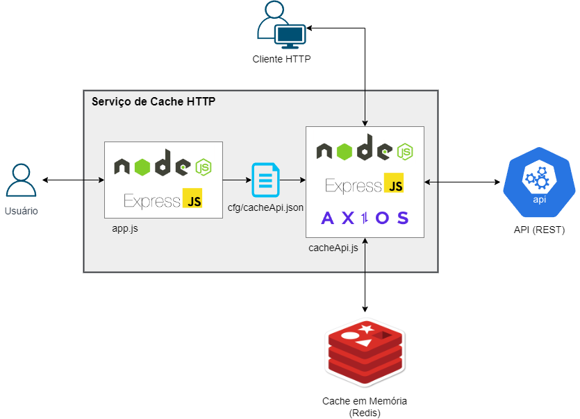

## Sistema de Cache HTTP com NodeJS e Redis

Sistema de Cache HTTP com NodeJS para cache de requisições HTTP com cache em memória usando Redis.



### Vídeos

[Protótipo da Telas](https://youtu.be/NFFzPlI0Su0)

[Demo](https://youtu.be/yhBSM_iEEUc)


### Requisitos:

- NodeJS: <https://nodejs.org/en/download>
- Docker: <https://www.docker.com/products/docker-desktop>
- Redis: <https://redis.io/download>

### Instruções gerais:
1 - Instale a imagem Docker do Redis:
``` 
$ docker pull redis
``` 

2 - Rode o container Redis:
```
$ docker run -d -p 6379:6379 -v data:/data --name redis redis
```

3 - Instale os módulos Javascript:
``` 
$ npm install
```

4 - As configurações podem ser encontradas no arquivo 'cfg/config.json'

### Instruções:

1 - Rode a API externa:
```
$ node ext_api.js
Servidor de cache funcionando na porta 8000 ...
```

2 - Abra o browser e abra a o servidor de cache: <http://localhost:8000>


### Teste de Desempenho:
1 - Instale o Locust: <https://locust.io/>

2 - Vá para a pasta **locust** e edite os scripts caso necessário

3 - Execute o script:
```
$ locust -f perf_test.py 
```

4 - Abra o browser em <http://localhost:8089> e execute o teste


