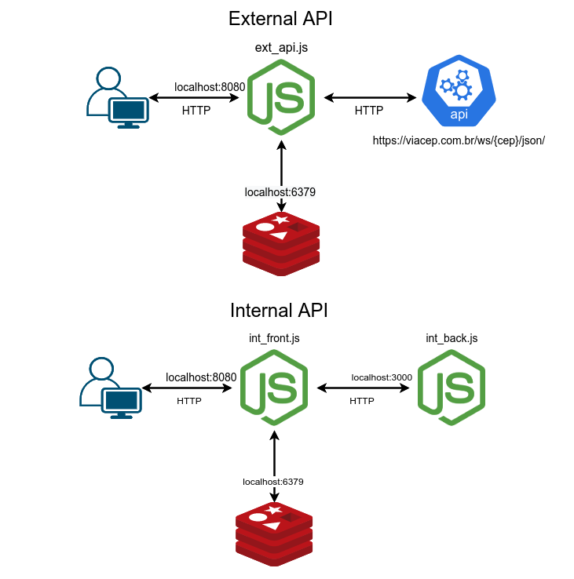
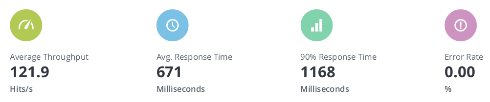
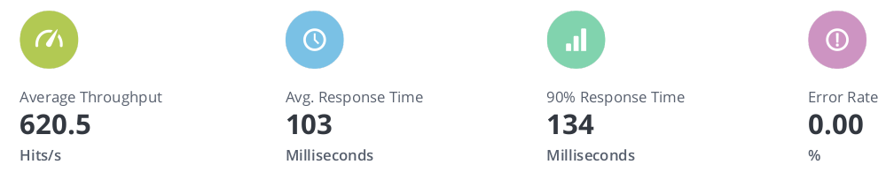
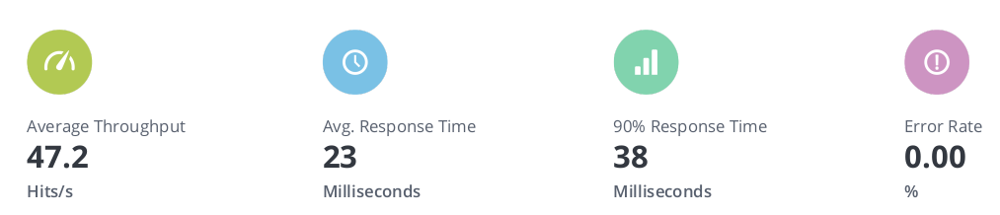
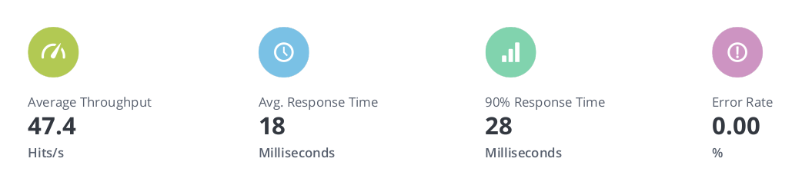
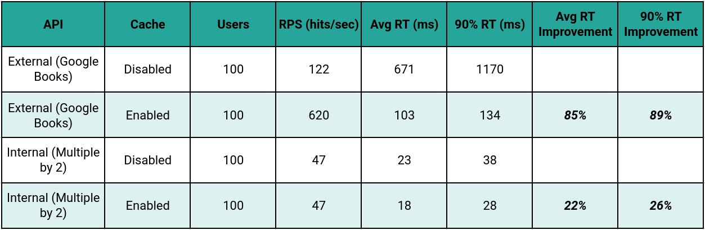

## JavaScript API with Redis cache

Basic JavaScript examples for caching HTTP responses using Redis.




### Requirements:

- NodeJS: <https://nodejs.org/en/download>
- Docker: <https://www.docker.com/products/docker-desktop>
- Redis: <https://redis.io/download>

### Common instructions:
1 - Install Redis docker image:
``` 
$ docker pull redis
``` 

2 - Run Redis container:
```
$ ./run_container.sh
```

3 - Install the modules:
``` 
$ npm install --save node-fetch express redis
```

### Instructions for the External API:

1 - Run the External API:
```
$ node ext_api.js
Using the following configuration from: 'cfg/config.json'
Redis Server: localhost | Port: 6379 | Enabled:  true | Cache Expire Time(s): 600
Back Server Port: 8080
Console Output: false
Server listening on 8080 port...
```

2 - Open other terminal and compare the response time by hiting the API (when the request is answered by the cache the response is faster). Postman is welcome here as well:
```
$ ./ext_api_test.sh
*   Trying 127.0.0.1:8080...
* Connected to localhost (127.0.0.1) port 8080 (#0)
> GET /book?isbn=8535914846 HTTP/1.1
...
"time_total": 0.006350,
...
```

### Instructions for the Internal API:

1 - Execute the Internal API Back:
```
$ node int_back.js
Using the following configuration from: 'cfg/config.json'
Back Server Port: 3000
Console Output: false
Waiting connections from API front...
```

2 - Open other terminal and run the Internal API Front:
```
$ node int_front.js
Using the following configuration from: 'cfg/config.json'
Redis Server: localhost | Port: 6379 | Enabled:  true | Cache Expire Time(s): 600
Front Server Port: 8080
Back Server Port: 3000
Console Output: false
```

3 - Open your browser and point to: <http://localhost:8080>

4 - Type any number and press 'Submit'. If you repeat the number within the cache expire time, it will use the Redis and the response time will be way faster.
```
API Request took 75 ms
API Request took 11 ms
Cache request took 3 ms
Cache request took 3 ms
```

### Load testing:
1 - Install the Locust: <https://locust.io/>

2 - Install the Taurus for BlazeMeter integration: <https://gettaurus.org/>

3 - Jump in **loadtest** folder and edit the `yml` files according to your needs

4 - Execute the test:
```
$ bzt <xxx.yml> -report
```

5 - A nice report will be generated at BlazeMeter

### External API Results:

- Simulating **100 users** with cache disabled:



- Simulating **100 users** with cache enabled:



### Internal API Results:

- Simulating **100 users** with cache disabled:



- Simulating **100 users** with cache enabled:



### Comparison:


