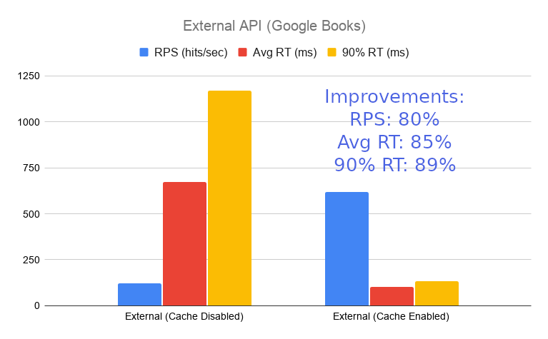

## API Cache com NodeJS e Redis

Scripts Javascript para cache de requisições HTTP com Redis.


### Requisitos:

- NodeJS: <https://nodejs.org/en/download>
- Docker: <https://www.docker.com/products/docker-desktop>
- Redis: <https://redis.io/download>

### Instruções gerais:
1 - Instale a imagem Docker do Redis:
``` 
$ docker pull redis
``` 

2 - Rode o container Redis:
```
$ docker run -d -p 6379:6379 -v data:/data --name redis redis
```

3 - Instale os módulos Javascript:
``` 
$ npm install --save node-fetch express redis
```

4 - As configurações podem ser encontradas no arquivo 'config.json'

### Instruções para API Externa:

1 - Rode a API externa:
```
$ node ext_api.js
Using the following configuration from: 'cfg/config.json'
Redis Server: localhost | Port: 6379 | Enabled:  true | Cache Expire Time(s): 600
Back Server Port: 8080
Console Output: false
Server listening on 8080 port...
```

2 - Abra outro terminal e verifique a tempo de resposta entre as requisições. A primeira deve ser maior e as subsequentes menores por conta do cache:
```
$ curl -v -w "@curl-format.txt" http://localhost:8080/location?cep=01310100
*   Trying 127.0.0.1:8080...
* Connected to localhost (127.0.0.1) port 8080 (#0)
> GET /location?cep=01310100 HTTP/1.1
...
{"cep":"01310-100","logradouro":"Avenida Paulista","complemento":"de 612 a 1510 - lado par","bairro":"Bela Vista","localidade":"São Paulo","uf":"SP","ibge":"3550308","gia":"1004","ddd":"11","siafi":"7107"}
...
"time_total": 0.002050,
...
```

### Intruções para API Interna:

1 - Execute a API Interna (back):
```
$ node int_back.js
Using the following configuration from: 'cfg/config.json'
Back Server Port: 3000
Console Output: false
Waiting connections from API front...
```

2 - Abra outro terminal e execute a API Interna (front):
```
$ node int_front.js
Using the following configuration from: 'cfg/config.json'
Redis Server: localhost | Port: 6379 | Enabled:  true | Cache Expire Time(s): 600
Front Server Port: 8080
Back Server Port: 3000
Console Output: false
```

3 - Abra o browser em <http://localhost:8080>

4 - Digite um número e pressine 'Enviar'. Se repetir o mesmo número dentro do tempo de expiração do cache a resposta será dada pelo Redis mais rapidamente. Observe os tempos no console:
```
Resultado da API: 13 ms
Resultado da API: 3 ms
Resultado com cache: 1 ms
Resultado com cache: 0 ms
```

### Teste de Desempenho:
1 - Instale o Locust: <https://locust.io/>

3 - Vá para a pasta **loadtest** e edite os scripts caso necessário

4 - Execute o teste:
```
$ bzt <xxx.yml> -report
```

5 - A nice report will be generated at BlazeMeter

### External API Results:

- Simulating **100 users** with cache disabled:


- Simulating **100 users** with cache enabled:


### Internal API Results:

- Simulating **100 users** with cache disabled:


- Simulating **100 users** with cache enabled:


### Comparison:




