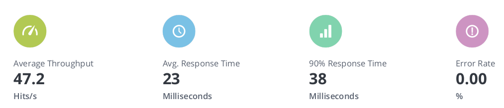

### JavaScript API with Redis cache

Basic JavaScript example for caching HTTP responses using Redis.

### Requirements:

- NodeJS: <https://nodejs.org/en/download>
- Docker: <https://www.docker.com/products/docker-desktop>
- Redis: <https://redis.io/download>

#### Instructions:
1 - Install Redis docker image:
``` 
$ docker pull redis
``` 

2 - Run Redis container:
```
$ ./run_container.sh
```

3 - Install the modules:
``` 
$ npm install --save node-fetch express redis
```

4 - Run the API Back:
```
$ node back.js
Using the following configuration from: 'cfg/config.json'
Back Server Port: 3000
Waiting connections from API front...
```

5 - Open other terminal and run the API Front:
```
$ node front.js
Using the following configuration from: 'cfg/config.json'
Redis Server: localhost | Port: 6379 | Cache Expire Time(s): 120
Front Server Port: 8080
Back Server Port: 3000
```

6 - Open your browser and point to: <http://localhost:8080>

7 - Type any number and press 'Submit'. If you repeat the same numer within the cache expire time, it will use the Redis and the response time will be way faster.
```
API Request took 75 ms
API Request took 11 ms
Cache request took 3 ms
Cache request took 3 ms
```

#### Load testing:
1 - Install the Locust: <https://locust.io/>

2 - Install the Taurus for BlazeMeter integration: <https://gettaurus.org/>

3 - Jump in <loadtest> folder and edit the <loadtest.yml> file according to your needs

4 - Execute the test:
```
$ bzt loadtest.yml -report
```

5 - A nice report will be generated at BlazeMeter

#### Results:

- Simulating **100 users** with cache enabled:


- Simulating **100 users** with cache disabled:



- **Cache Enabled:**  Avg Resp Time: 18 ms | 90% Resp Time: 28 ms

- **Cache Disabled:** Avg Resp Time: 23 ms | 90% Resp Time: 38 ms
